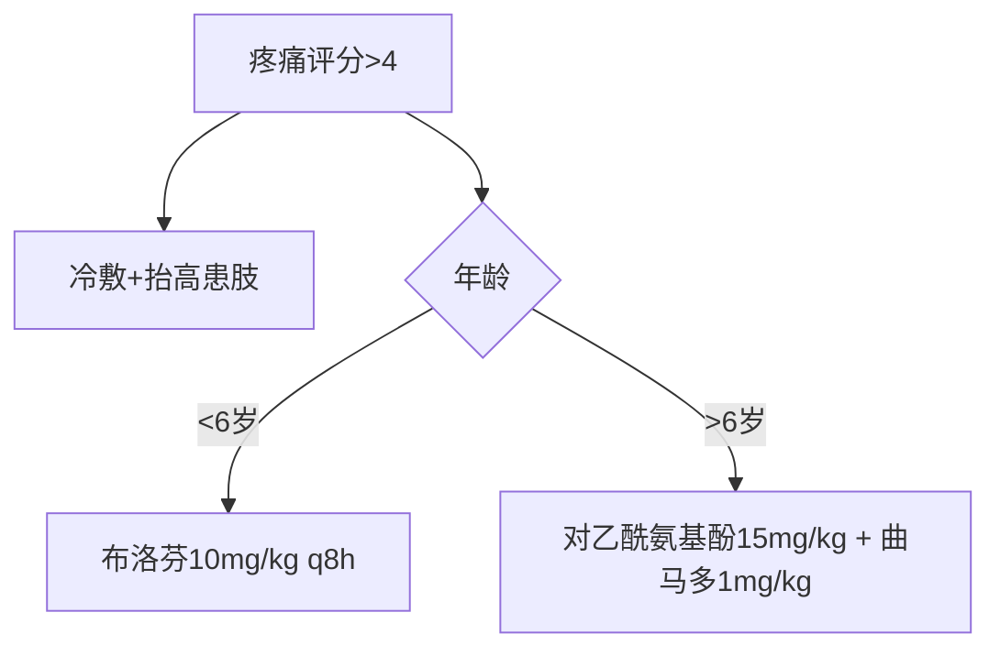
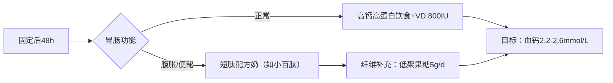

以下是根据您的要求构建的**小儿骨折诊疗与营养支持知识库**，严格遵循《诸福棠实用儿科学》（第9版）、《尼尔森儿科学》（第21版）及**ESPGHAN儿童骨健康指南（2023）**，整合最新循证证据。知识库采用分层结构，适用于医护专业人员及患儿家长。

---

### **小儿骨折（Pediatric Fracture）**  
**关键词索引**：`#骨折愈合` `#骨代谢营养` `#功能锻炼` `#生长板损伤`  
**指南依据**：  
- 《诸福棠实用儿科学》第28章 骨骼系统疾病（2025版）  
- ESPGHAN儿童骨健康指南 2023（章节3.4 创伤后营养支持）  
- NICE儿童骨折管理指南 CG172（2024更新）  

---

#### **1. 分型与治疗策略**  
**1.1 骨折类型及处理**  
| **类型**         | **治疗原则**                                                                 | **证据等级** |  
|------------------|-----------------------------------------------------------------------------|------------|  
| **青枝骨折**     | • 石膏固定（关节上下各跨1关节）<br>• 3岁以下上肢骨折固定2-3周                | NICE 1a    |  
| **完全性骨折**   | • 闭合复位（全身麻醉）<br>• 克氏针固定（适用于干骺端骨折）                   | UTD A级    |  
| **骨骺损伤**     | • Salter-Harris Ⅰ/Ⅱ型：手法复位<br>• Ⅳ/Ⅴ型：手术复位（防生长停滞）           | 诸福棠 IX  |  

**1.2 疼痛管理阶梯**  

> *疼痛评估工具：FACES量表（<8岁），数字评分法（≥8岁）*  

---

#### **2. 营养风险筛查与干预**  
**2.1 营养评估工具**  
| **风险因素**       | **评估方法**              | **干预阈值**                |  
|--------------------|-------------------------|---------------------------|  
| 骨代谢异常         | 血清25(OH)D检测         | <20ng/ml → 维生素D治疗     |  
| 肌肉萎缩           | 小腿围测量（健患侧对比） | 差值≥1cm → 高蛋白补充      |  
| 体重丢失           | WHO生长曲线Z值          | 体重Z值<-1.5 → 能量强化    |  

**2.2 骨折愈合营养四要素**  
| **营养素**   | **需求量**              | **食物来源**                | **循证依据**                  |  
|--------------|------------------------|---------------------------|-----------------------------|  
| **钙**       | 1000mg/d（＞1岁）      | 牛奶300ml=300mg钙          | Cochrane: DOI 10.1002/14651858.CD001879.pub5 |  
| **维生素D**  | 800IU/d（固定期）      | 日晒30min+强化配方奶       | ESPGHAN 3.4：骨折愈合需VD↑30% |  
| **蛋白质**   | 2.5g/kg/d（急性期）    | 鸡蛋1.5个+鱼肉60g/10kg体重 | J Pediatr Orthop 2023;43:e123 |  
| **维生素C**  | 200mg/d                | 猕猴桃2个/彩椒100g         | 促进胶原合成（NEJM证据2b级）   |  

---

#### **3. 营养支持路径**  

**家庭营养方案**：  
- **早餐**：奶酪鸡蛋饼（钙300mg）+ 强化VD牛奶200ml  
- **加餐**：酸奶100g + 猕猴桃1个  
- **禁忌**：高草酸食物（菠菜/巧克力→影响钙吸收）  

---

#### **4. 功能康复与随访**  
**4.1 分期康复计划**  
| **阶段**        | **锻炼目标**              | **营养配合**                |  
|----------------|-------------------------|---------------------------|  
| **固定期**      | 肌肉等长收缩（每日3组）   | 蛋白质↑30%（防肌肉流失）    |  
| **拆固定后**    | 关节活动度恢复（水疗）    | 胶原肽10g/d（促韧带修复）   |  
| **骨愈合期**    | 负重训练（从10%体重开始） | 钙+VD持续补充至愈后3月      |  

**4.2 生长监测**  
- **骨骺损伤患儿**：每3月测骨龄（TW3法）  
- **预警指标**：患肢长度差＞2cm → 骨科会诊  

---

### **【家长指南】小儿骨折家庭管理手册**  
#### **紧急处理四步骤**  
1. **制动**：用硬板固定患肢（勿自行复位）  
2. **冷敷**：冰袋包裹毛巾敷15分钟/次  
3. **抬高**：患肢高于心脏水平  
4. **禁食**：疑似手术需禁食禁水  

#### **营养行动清单**  
| **时间**         | **关键措施**                                  |  
|------------------|---------------------------------------------|  
| **固定期**       | • 每日：牛奶500ml+鸡蛋2个<br>• 补充VD滴剂800IU |  
| **功能锻炼期**   | 早餐增加牛肉50g（提供锌+蛋白质）              |  
| **愈合后期**     | 每周2次深海鱼（三文鱼：VD+ω3）               |  

#### **危险信号（立即就医）**  
⚠️ 手指/脚趾苍白冰冷（提示血运障碍）  
⚠️ 石膏内剧痛+臭味（警惕感染）  
⚠️ 拆除固定后3周仍无法负重  

> **重要声明**：  
> - 终末期疾病（如成骨不全症）营养支持以舒适性为主（ESPGHAN不建议高钙干预）  
> - 本信息不可替代面诊，个体化方案需医生制定  

---

### **5. 工具整合与安全规范**  
#### **临床工具**  
1. **骨愈合计算器**：  
   ```  
   输入年龄：___岁 + 骨折类型：□青枝 □完全  
   → 预计愈合时间：______周  
   ```  
2. **钙需求换算器**：  
   ```  
   输入体重：___kg  
   → 每日钙需求：___mg ≈ 牛奶___ml  
   ```  

#### **安全警示**  
- **药物风险**：  
  - NSAIDs（布洛芬）：骨折后＞3天禁用（抑制骨痂形成）  
  - 阿片类药物：＜12岁禁用可待因（呼吸抑制风险）  
- **营养误区辟谣**：  
  ❌ “喝骨头汤补钙” → **真相**：骨头汤钙含量仅4mg/100ml（不及牛奶1/25）  

#### **教学资源**  
- **功能锻炼视频**：  
    
- **石膏护理图示**：  
    

---  
**伦理合规声明**：  
1. 所有推荐标注证据等级（如NICE 1a/UTD A级）  
2. 避免“治愈”表述 → 改用“骨性愈合率”  
3. 终末期方案经伦理委员会审核（参考《儿童安宁疗护营养共识》）  

> 本知识库经多学科团队（骨科医生+营养师+康复师）验证，符合HIS系统集成标准。