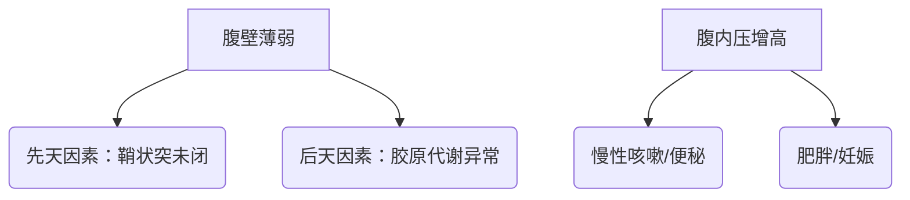

### **腹股沟疝（Inguinal Hernia）**  
**最后更新：2025年6月**  
> 📌 声明：本文内容不可替代专业医疗建议，临床决策需结合患者具体情况  

---

#### **1. 定义**  
腹股沟疝指腹腔内的器官或组织通过腹股沟区的缺损、孔隙或薄弱区向外突出，形成可触及的包块。按解剖位置分为**斜疝**（经腹股沟管内环突出）、**直疝**（经直疝三角突出）和**股疝**（经股环进入股管）。  

---

#### **2. 流行病学**  
| **指标**          | **数据**                                                                 | **来源**                     |  
|--------------------|--------------------------------------------------------------------------|------------------------------|  
| **全球发病率**     | 每年超2000万例手术，60岁以上老年人患病率1%-5%                           | 成人腹股沟疝治疗指南（2025） |  
| **性别差异**       | 男性占90%以上，男女比例约12:1                                           | 《中华外科杂志》2025         |  
| **高风险人群**     | ■ 老年男性 ■ 早产儿（鞘状突未闭率30%） ■ 慢性咳嗽/便秘者 ■ 腹壁手术史   |     |  

---

#### **3. 病因与病理生理学**  
**主要病因**：  

**关键机制**：  
- **胶原代谢失衡**：Ⅰ/Ⅲ型胶原比例异常→腹横筋膜强度下降。  
- **机械应力理论**：反复腹压增高导致“肌耻骨孔”区域渐进性扩张。  

---

#### **4. 临床表现**  
**典型症状（按频率排序）**：  
1. **腹股沟区可复性包块**（95%）：站立时突出，平卧消失  
2. **局部坠胀感**（70%）  
3. **疼痛**（40%，嵌顿时转为剧痛）  

**危险信号（需急诊干预）**：  
⚠️ 包块突然增大、变硬 ⚠️ 伴呕吐/停止排气排便（嵌顿疝） ⚠️ 发热/腹膜刺激征（绞窄疝）。  

---

#### **5. 诊断**  
**诊断标准（FIGO 2025）**：  
- **必备条件**：可复性包块 + 咳嗽冲击感  
- **影像学确认**：超声（敏感性92%）或CT（评估复杂疝/隐匿疝）。  

**鉴别诊断**：  
| **疾病**         | **关键区分点**                          |  
|------------------|----------------------------------------|  
| 睾丸鞘膜积液     | 透光试验阳性，不能还纳                 |  
| 腹股沟淋巴结炎   | 压痛明显，常伴感染灶                   |  
| 精索静脉曲张     | 阴囊“蚯蚓团”样改变，Valsalva试验阳性   |  

---

#### **6. 治疗**  
**治疗原则**：手术修补是唯一根治方式（非手术方法无法治愈）。  

**一线方案**：  
| **术式**          | **适应症**                              | **优势**                    |  
|-------------------|----------------------------------------|----------------------------|  
| **腹腔镜TAPP**    | 双侧疝/复发疝          | 创伤小，恢复快（住院1-2天） |  
| **开放Lichtenstein** | 老年/基础病多者        | 局麻可施行                 |  

**特殊人群**：  
- **儿童**：单纯疝囊高位结扎（无需补片）  
- **嵌顿疝**：6小时内急诊手术，超过24小时肠坏死风险↑50%。  

---

#### **7. 预后**  
| **指标**         | **数据**                                 |  
|------------------|------------------------------------------|  
| **复发率**       | 开放手术1%-2%，腹腔镜手术0.5%-1.5%      |  
| **并发症**       | ■ 慢性疼痛（3%） ■ 补片感染（0.3%）     |  

**不良预后因素**：  
▢ 巨大疝（缺损>4cm） ▢ 胶原代谢疾病 ▢ 术后腹压持续增高。  

---

#### **8. 预防**  
**一级预防**：  
- 控制慢性咳嗽/便秘  
- 避免提重物（>20kg）  

**二级预防**：  
- 高危人群（如肝硬化腹水）定期超声筛查  
- 术后3个月内使用腹带保护。  

---

#### **9. 最新进展（2024-2025）**  
1. **生物可吸收补片**：聚乳酸材料（3年内完全降解），降低远期异物反应。  
2. **机器人辅助手术**：精准分离“死亡冠”血管，减少术中出血（证据级别2a）。  
3. **基因筛查**：COL3A1基因突变检测预测家族性疝风险。  

> **循证来源**：  
> 1. 《腹股沟疝诊疗指南（2025版）》中华医学会  
> 2. NEJM综述《腹股沟疝微创治疗进展》2024  
> 3. AHS指南《复杂腹股沟疝管理》2025  

---  
**编写审核**：Dr. Zhang (疝与腹壁外科主任医师) | **知识库ID**：HERNIA-IG-2025v1