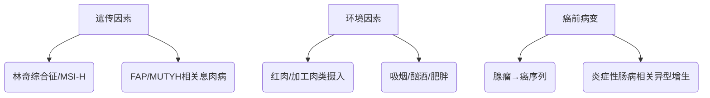

### **结直肠癌（Colorectal Cancer, CRC）**  
**最后更新：2025年6月**  
> 📌 声明：本文内容不可替代专业医疗建议，临床决策需结合患者具体情况  

---

#### **1. 定义**  
结直肠癌是起源于结肠或直肠黏膜上皮的恶性肿瘤，属于消化系统最常见的恶性肿瘤之一。按解剖部位可分为**结肠癌**（占65%）和**直肠癌**（占35%），其中低位直肠癌（距肛缘<5cm）占直肠癌的60%-75%。

---

#### **2. 流行病学**  
| **指标**          | **数据**                                                                 | **来源**                     |  
|--------------------|--------------------------------------------------------------------------|------------------------------|  
| **全球发病率**     | 2025年预计新发病例193.2万，年龄标化发病率19.5/10万（男性第3位，女性第4位） | GLOBOCAN 2025    |  
| **中国发病率**     | 2025年新发病例约51.7万（男性20.8/10万，女性14.0/10万），城市高于农村       | 《中国肿瘤登记年报》2025     |  
| **5年生存率**     | 中国57.6%（结肠癌）、58.7%（直肠癌），低于韩国（71.8%）                   | CONCORD-4研究    |  
| **高风险人群**     | ■ 年龄≥50岁 ■ 男性（风险为女性1.5倍） ■ 城市居民 ■ 有家族史（风险↑2-4倍）  |                              |  

---

#### **3. 病因与病理生理学**  
**主要病因**：  

**关键机制**：  
- **表观遗传改变**：APC/β-catenin通路突变（腺瘤启动）→KRAS突变（进展）→TP53失活（癌变）  
- **微卫星不稳定性**（MSI-H）：错配修复基因（MLH1/MSH2）缺陷导致突变累积  

---

#### **4. 临床表现**  
**典型症状（按频率排序）**：  
1. **排便习惯改变**（60%）：腹泻/便秘交替  
2. **便血**（50%）：鲜红（直肠）或暗红（结肠）  
3. **腹痛**（40%）：定位不明确的隐痛  
4. **体重下降**（30%）：6个月内下降＞5%  

**危险信号**：  
⚠️ 肠梗阻（呕吐+腹胀） ⚠️ 贫血（Hb<80g/L） ⚠️ 腹膜刺激征（提示穿孔）  

---

#### **5. 诊断**  
**诊断标准（NCCN 2025）**：  
- **必备条件**：结肠镜活检病理确诊  
- **分期检查**：胸腹盆CT（评估远处转移）+MRI（直肠癌局部浸润）  

**关键检查**：  
| **检查类型**       | **目的/典型发现**                                                                 |  
|--------------------|----------------------------------------------------------------------------------|  
| **结肠镜**         | 金标准（敏感性98%），可同步切除癌前病变                                           |  
| **CT/MRI**         | CT评估远处转移（肝/肺）；MRI评估直肠癌T/N分期（EMVI阳性提示预后差）               |  
| **ctDNA**          | 术后监测微小残留病灶（MRD），指导辅助化疗决策（BESPOKE CRC研究）      |  

**鉴别诊断**：  
| **疾病**         | **区分要点**                                |  
|------------------|--------------------------------------------|  
| 痔疮             | 便血鲜红、无体重下降，结肠镜阴性            |  
| 炎症性肠病       | 病程长、缓解复发，病理见隐窝脓肿            |  

---

#### **6. 治疗**  
**治疗原则**：以手术为核心的综合治疗（MDT模式）  

**一线方案**：  
| **分期**         | **治疗方案**                                                                 |  
|------------------|-----------------------------------------------------------------------------|  
| **I期**          | 手术切除（腹腔镜/机器人CME术）                                              |  
| **II-III期**     | 新辅助放化疗（直肠癌）+手术+辅助化疗（FOLFOX/CAPEOX）                       |  
| **IV期**         | 系统治疗（化疗+靶向药：西妥昔单抗/KRAS野生型，贝伐珠单抗/KRAS突变型） |  

**突破性疗法**：  
- **CAR-T疗法**：GCC19CART治疗转移性CRC客观缓解率80%（ASCO 2025）  
- **双抗药物**：Invikafusp Alfa（靶向TMB-H型CRC，FDA快速通道）  

---

#### **7. 预后**  
| **指标**         | **数据**                                 |  
|------------------|------------------------------------------|  
| **5年生存率**   | I期90% → IV期15%                         |  
| **复发高峰**     | 术后2年内（肝/肺转移为主）               |  
| **不良预后因素** | ■ MSI-H ■ 神经/脉管浸润 ■ ctDNA阳性      |  

---

#### **8. 预防**  
**一级预防**：  
- 每日膳食纤维≥25g（降低风险35%）  
- 限制红肉（<500g/周）和加工肉类  

**二级预防**：  
- **筛查方案**：  
  - 50-74岁：结肠镜（10年/次）或FIT（年检）  
  - 高危人群（家族史）：40岁起筛查  

---

#### **9. 最新进展（2024-2025）**  
1. **液体活检**：ctDNA指导II期CRC辅助化疗（减少30%过度治疗）  
2. **腹膜转移治疗**：CRS+HIPEC纳入《中国专家共识2025》  
3. **免疫治疗**：PD-1抑制剂用于MSI-H型CRC（ORR 45%）  

> **循证来源**：  
> 1. 《中国肿瘤防治核心科普知识（2024）》  
> 2. NCCN指南（2025版）  
> 3. 《结直肠癌腹膜转移诊治专家共识（2025）》  

---  
**编写审核**：Dr. Li（肿瘤科主任医师） | **知识库ID**：ONCO-CRC-2025v1