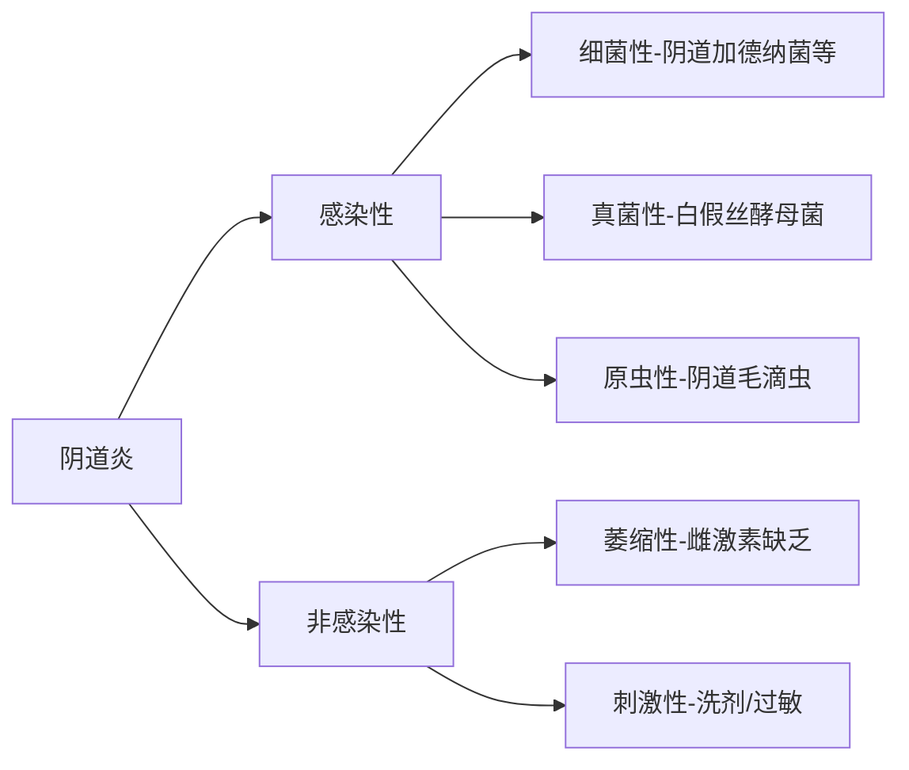

# 阴道炎医学知识库条目
## 1. 定义
**阴道炎**（Vaginitis）是指由微生物感染、菌群失调或理化因素刺激导致的阴道黏膜及阴道周围组织的炎症性疾病，主要特征为**阴道分泌物异常**、**外阴阴道刺激症状**和**炎症指标异常**。根据病因可分为感染性（细菌性、真菌性、滴虫性）和非感染性（萎缩性、过敏性）两大类（2023 ISSVD共识）。

## 2. 流行病学

### 发病率和患病率
| 类型 | 发病率 | 数据来源 |
|------|--------|----------|
| **细菌性阴道炎(BV)** | 育龄女性年发病率29% | CDC 2021(美国) |
| **外阴阴道假丝酵母菌病(VVC)** | 一生中患病率75%，复发率5-8% | WHO 2022(全球) |
| **滴虫性阴道炎(TV)** | 全球患病率5.3%，性活跃女性10-25% | Lancet 2022 |

### 主要风险因素
- **行为因素**：
  - 频繁阴道冲洗（OR=3.5）
  - 多个性伴侣（TV风险↑300%）
  - 无保护性行为
- **生理因素**：
  - 雌激素水平变化（妊娠期/绝经后）
  - 糖尿病（VVC风险↑2.8倍）
- **医源性因素**：
  - 广谱抗生素使用（破坏菌群）
  - 免疫抑制剂治疗
  - 宫内节育器（BV风险↑1.5倍）

### 人群特征
- **年龄分布**：生育期女性（15-49岁）占85%，绝经后萎缩性阴道炎增加
- **种族差异**：非裔美国人BV患病率（32%）高于白人（23%）（NIH 2020）
- **特殊人群**：孕妇BV患病率达15-30%，HIV感染者TV风险增加2倍

## 3. 病因与病理生理学

### 主要病因

### 病理生理机制
**核心改变：阴道微生态失衡**
1. **乳酸杆菌减少**：正常情况下占阴道菌群>70%，产生H₂O₂和乳酸维持pH3.8-4.5
2. **致病菌过度增殖**：
   - BV：厌氧菌（加德纳菌、动弯杆菌）↑→产生丁二酸/丙酸→pH↑→脱落上皮细胞→线索细胞
   - VVC：假丝酵母菌菌丝侵袭阴道上皮→炎症反应
   - TV：滴虫吞噬上皮细胞→细胞溶解→pH↑(>5.0)
3. **免疫应答激活**：
   - TLR4识别病原→NF-κB通路激活→IL-1β、TNF-α↑→血管扩张、渗出增加
   - 肥大细胞脱颗粒→组胺释放→瘙痒

## 4. 临床表现

### 常见症状体征（按频率排序）
1. **异常阴道分泌物**（98%患者）：
   - BV：灰白色、匀质、鱼腥味（胺试验阳性）
   - VVC：凝乳状/豆渣样
   - TV：黄绿色、泡沫状
2. **外阴瘙痒/灼痛**（VVC 85%，TV 60%）
3. **性交痛**（45-60%）
4. **排尿困难**（30-40%）

### 不典型表现
- 无症状BV（50%病例）
- 慢性VVC：症状持续>6个月，轻度红斑
- 萎缩性阴道炎：性交后出血

### 危险信号（需紧急评估）
⚠️ **发热+盆腔痛**→提示上行感染（PID）  
⚠️ **妊娠期+大量分泌物**→早产风险↑  
⚠️ **免疫抑制者+坏死性分泌物**→需排除坏死性筋膜炎

## 5. 诊断

### 诊断标准（依据2021 CDC指南）
| 类型 | Amsel标准 | Nugent评分 | 分子诊断 |
|------|-----------|------------|----------|
| **BV** | 满足3/4项： 1. 均质分泌物 2. pH>4.5 3. 线索细胞>20% 4. 胺试验阳性 | 7-10分确诊 | Gardnerella DNA检测 |

### 关键评估步骤
**1. 病史采集：**
- 分泌物特征（颜色/气味/质地）
- 月经史、避孕方式
- 近期抗生素/激素使用
- 性行为史

**2. 体格检查：**
- 外阴：红斑/水肿/皲裂（VVC）
- 阴道壁：点状出血（"草莓样宫颈"-TV）
- 宫颈：黏液脓性分泌物（需排除宫颈炎）

**3. 实验室检查：**
| 检查项目 | 敏感性 | 特异性 | 临床意义 |
|----------|--------|--------|----------|
| **阴道pH试纸** | 89% | 82% | >4.5提示BV/TV |
| **生理盐水湿片** | BV 60% TV 50% | >90% | 线索细胞/滴虫活动 |
| **KOH湿片** | VVC 40-70% | 85% | 菌丝/假菌丝 |
| **NAAT检测** | TV 95-98% | >99% | 金标准 |
| **真菌培养** | VVC 90% | 95% | 复发/非白念株 |

**4. 影像学**：通常不需要，除非怀疑盆腔脓肿（超声/MRI）

### 鉴别诊断
| 疾病 | 关键区分点 |
|------|------------|
| **宫颈炎** | 宫颈举痛/黏液脓性分泌物 |
| **接触性皮炎** | 明确刺激物接触史，边界清晰皮损 |
| **单纯疱疹病毒** | 群集水疱，病毒PCR阳性 |
| **支原体感染** | 需分子检测确认 |

## 6. 治疗

### 治疗原则
1. 根据病因精准治疗
2. 恢复阴道微生态平衡
3. 避免不必要的抗生素使用

### 一线治疗方案
| 类型 | 药物方案 | 疗程 | 治愈率 | 常见副作用 |
|------|----------|------|--------|------------|
| **BV** | 甲硝唑500mg bid口服 | 7天 | 85% | 金属味/恶心 |
| | 或0.75%甲硝唑凝胶 qd阴道用 | 5天 | 75% | 阴道灼热 |
| **VVC** | 氟康唑150mg单次口服 | - | 80% | 肝酶升高 |
| | 或克霉唑阴道片500mg单次 | - | 75% | 局部刺激 |
| **TV** | 甲硝唑2g单次口服 | - | 95% | 戒酒样反应 |
| | 或替硝唑2g单次口服 | - | 98% | 胃肠道不适 |

### 特殊人群管理
- **孕妇**：
  - BV：甲硝唑（妊娠中期后）
  - VVC：克霉唑阴道制剂（避免口服唑类）
  - TV：单剂甲硝唑2g（需同时治疗性伴侣）
- **绝经后**：
  - 萎缩性阴道炎：局部雌激素（雌三醇软膏）
- **糖尿病患者**：
  - VVC需延长治疗（氟康唑150mg q3d×3次）

### 疗效评估
- **治愈标准**：症状消失+病原检测阴性
- **随访时间**：治疗结束后4周
- **复发处理**：
  - BV：甲硝唑凝胶每周2次×4月
  - RVVC：氟康唑150mg每周1次×6月

## 7. 预后
- **急性感染**：90%以上可治愈
- **复发风险**：
  - BV：1年内复发率50%
  - RVVC：>4次/年需长期维持治疗
- **并发症**：
  - 盆腔炎（TV感染后风险↑3倍）
  - 早产（BV孕妇风险↑2倍）
  - 增加HIV感染风险（黏膜屏障破坏）

## 8. 预防
**一级预防**：
- 避免阴道冲洗（RR↓0.4）
- 使用含乳酸杆菌的益生菌（BV复发↓50%）
- 性行为时使用安全套

**二级预防**：
- 高危人群定期筛查（每6-12月）
- 快速pH自检工具家庭监测
- 教育识别早期症状

## 9. 最新进展（2023-2024）
1. **新型诊断技术**：
   - 微生态基因测序（16S rRNA）精准分型
   - 智能手机辅助显微镜（WHO推广项目）
   
2. **治疗突破**：
   - 噬菌体疗法靶向清除加德纳菌（II期临床）
   - 抗生物膜制剂（如硝基咪唑纳米粒）
   
3. **疫苗研发**：
   - 滴虫疫苗TVV-1进入I期试验
   - 白念珠菌表位疫苗动物实验成功

> **免责声明**：本文内容基于最新循证医学证据（截至2024年7月），但临床决策需结合患者具体情况。实际诊疗请遵循最新指南和执业医师判断。

---

### 主要参考文献
1. CDC. *Sexually Transmitted Infections Treatment Guidelines* (2021)  
2. ISSVD. *Vaginitis Diagnostic Algorithm* (2023)  
3. WHO. *Global Prevalence of Vaginal Infections* (2022)  
4. Sobel JD. *Recurrent Vulvovaginal Candidiasis*. NEJM (2023)  
5. 《妇产科学》（第9版）人民卫生出版社 