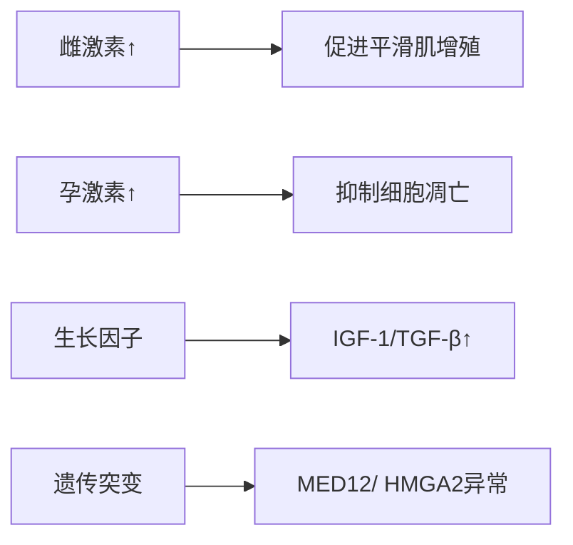

# 子宫肌瘤医学知识库条目

## 1. 定义
**子宫肌瘤**（Uterine Leiomyoma）是起源于子宫平滑肌细胞的**良性单克隆肿瘤**，由平滑肌和纤维结缔组织组成，又称子宫纤维瘤。根据FIGO 2011分类系统，按位置分为：
- 0型：完全位于宫腔内的黏膜下肌瘤
- 1-2型：黏膜下肌瘤（肌壁内部分<50%）
- 3-7型：肌壁间和浆膜下肌瘤
- 8型：其他特殊类型（宫颈/阔韧带肌瘤）
(ACOG 2021指南)

## 2. 流行病学

### 发病率和患病率
| 人群 | 患病率 | 数据来源 |
|------|--------|----------|
| **育龄女性总体** | 20-50% | NEJM 2023 |
| **>50岁女性** | >70%（尸检数据） | Lancet 2022 |
| **中国育龄女性** | 30.8%（超声筛查） | 中华妇产科杂志2022 |

### 主要风险因素
- **激素暴露**：
  - 初潮早（<11岁，RR=1.5）
  - 未生育（RR=2.5）
- **遗传因素**：
  - 一级亲属患病（RR=2.9）
  - MED12基因突变（50%肌瘤）
- **代谢因素**：
  - 肥胖（BMI>30，RR=1.8）
  - 高血压（RR=1.5）

### 人群特征
- **年龄**：30-50岁高发，高峰在40-49岁
- **种族差异**：非裔女性发病率是白人女性的3倍，且发病更早、瘤体更大（NIH 2023）
- **特殊人群**：不孕症女性中患病率40-50%

## 3. 病因与病理生理学

### 核心机制：激素依赖性生长


**分子通路**：
1. **雌激素作用**：
   - 结合ERα→激活MAPK通路→cyclin D1↑→细胞周期加速
   - 抑制p53促凋亡功能
2. **孕激素作用**：
   - 激活Bcl-2抗凋亡蛋白
   - 诱导EGF/VEGF→血管生成
3. **遗传改变**：
   - MED12外显子2突变（70%肌瘤）→Wnt通路激活
   - HMGA2重排（10%）→染色体7q缺失

## 4. 临床表现

### 常见症状（按频率排序）
1. **异常子宫出血**（60%）：
   - 月经过多（HMB）
   - 经期延长
2. **盆腔压迫症状**（40%）：
   - 尿频/便秘
   - 下腹坠胀感
3. **疼痛**（30%）：
   - 痛经（继发性）
   - 性交痛
4. **不孕/流产**（15%）：
   - 黏膜下肌瘤致宫腔变形

### 不典型表现
- 无症状（30-50%）
- 带蒂肌瘤扭转→急性腹痛
- 红色变性（妊娠期）
- 静脉内平滑肌瘤病（罕见）

### 危险信号（需排除恶性）
⚠️ **绝经后肌瘤增大**→肉瘤变风险（0.1-0.5%）  
⚠️ **血清LDH>250 U/L**→提示平滑肌肉瘤  
⚠️ **短期快速增大**（>2cm/6月）  
⚠️ **多普勒超声中央血流丰富+低阻频谱**

## 5. 诊断

### 诊断标准（FIGO 2021）
1. 影像学证实子宫肌层或宫腔占位
2. 排除其他盆腔肿块（超声/MRI）
3. 病理确诊（仅治疗前需要）

### 关键评估步骤
**1. 病史采集**：
- 月经模式（PBAC评分评估出血量）
- 生育要求
- 家族肿瘤史（尤其Lynch综合征）

**2. 体格检查**：
- 腹部触诊：不规则增大子宫
- 双合诊：活动无压痛包块
- 妇科检查：黏膜下肌瘤可脱出宫颈口

**3. 实验室检查**：
| 项目 | 意义 | 注意 |
|------|------|------|
| **血常规** | 评估贫血程度（HMB患者） | Hb<100g/L需干预 |
| **hCG** | 排除妊娠相关疾病 | 育龄女性必查 |
| **甲状腺功能** | 排除甲减导致的月经过多 | |
| **肿瘤标志物** | LDH>250U/L警惕肉瘤变 | 特异性低 |

**4. 影像学检查**：
| 检查类型 | 典型表现 | 敏感性 | 特异性 |
|----------|----------|--------|--------|
| **经阴道超声** | 类圆形低回声团，声影 | 90% | 85% |
| **MRI T2加权** | 低信号包膜，漩涡状结构 | 98% | 95% |
| **宫腔声学造影** | 黏膜下肌瘤定位 | 100%黏膜下 | 90% |
| **诊断性宫腔镜** | 直视瘤体，可同时活检 | 金标准 | 100% |

### 鉴别诊断
| 疾病 | 关键区分点 |
|------|------------|
| **子宫腺肌病** | 痛经进行性加重，超声见"栅栏征" |
| **子宫内膜息肉** | 宫腔内高回声，无漩涡状结构 |
| **子宫肉瘤** | 血流丰富（RI<0.4），LDH↑ |
| **卵巢肿瘤** | 双合诊包块与子宫分离 |
| **妊娠子宫** | hCG阳性，可见孕囊 |

## 6. 治疗

### 治疗原则
- 无症状者：观察（每6-12月复查）
- 有症状者：根据年龄/生育需求选择方案
- 疑似恶性：手术切除+快速病理

### 一线治疗方案
**药物治疗**（适用于出血症状为主）：
```markdown
1. **左炔诺孕酮宫内缓释系统（LNG-IUS）**：
   - 适用：子宫<孕12周，宫腔深度<10cm
   - 效果：减少月经量90%（NEJM 2021）
   - 禁忌：黏膜下肌瘤>3cm

2. **促性腺激素释放激素激动剂（GnRH-a）**：
   - 方案：亮丙瑞林3.75mg/月 IM×6月
   - 效果：缩瘤35-50%，术前准备
   - 副作用：低雌激素症状（骨密度↓）

3. **选择性孕激素受体调节剂（SPRMs）**：
   - 乌利司他5mg/d PO×3月
   - 效果：控制出血（98%患者），缩瘤30%
   - 注意：监测肝功能
```

**非药物治疗**：
- **子宫动脉栓塞术（UAE）**：适用于多发肌瘤，保留子宫
- **聚焦超声消融（FUS）**：<10cm单发肌瘤，无生育需求

### 二线/手术治疗
| 术式 | 适应证 | 注意事项 |
|------|--------|----------|
| **宫腔镜肌瘤切除** | 黏膜下肌瘤（FIGO 0-2型） | 需预防TURP综合征 |
| **腹腔镜/开腹肌瘤剔除** | 有生育需求者 | 复发率15%/5年 |
| **全子宫切除** | 无生育需求/疑恶变 | 根治疗法 |

### 特殊人群管理
- **孕产妇**：
  - 妊娠期一般观察（红色变性可保守治疗）
  - 剖宫产时剔除肌瘤争议大（出血风险↑）
- **围绝经期**：
  - 首选药物治疗过渡至绝经
  - 慎用雌激素替代
- **合并抗凝治疗者**：
  - 避免使用LNG-IUS（出血风险↑）
  - 考虑UAE/FUS

### 疗效评估
- **临床指标**：
  - 月经失血图（PBAC）评分↓>50%
  - 肌瘤体积缩小率（超声测量）
- **随访时间**：
  - 药物治疗：3月评估疗效
  - 术后：6月/1年复查

## 7. 预后
| 指标 | 数据 | 影响因素 |
|------|------|----------|
| **自然病程** | 绝经后缩小40-60% | 雌激素水平 |
| **复发率** | 肌瘤剔除术后50%/10年 | 年龄/肌瘤数量 |
| **恶变风险** | 0.1-0.5% | 快速增大史 |
| **生育影响** | 黏膜下肌瘤降低妊娠率30% | 宫腔变形程度 |

## 8. 预防
**一级预防**（证据有限）：
- 控制体重（BMI<25）
- 长期COC使用（RR↓0.7）
- 避免环境雌激素暴露（双酚A/塑化剂）

**二级预防**：
- 高危人群每年妇科超声
- 异常出血及时评估
- 基因检测（家族性肌瘤综合征）

## 9. 最新进展（2023-2024）
1. **靶向药物**：
   - GnRH拮抗剂（瑞卢戈利）口服制剂（PRIMROSE试验）
   - 芳香酶抑制剂（来曲唑）缩小肌瘤45%（JAMA 2023）

2. **微创技术**：
   - 经宫颈射频消融（Sonata系统）
   - 机器人单孔腹腔镜（FDA批准2023）

3. **基础研究**：
   - 靶向MED12基因的siRNA疗法（动物实验）
   - 肿瘤干细胞标志物CD44v6的抗体治疗

> **免责声明**：本文内容依据循证医学证据（截至2024年），但临床决策需个体化。具体诊疗请遵循最新指南和执业医师建议。

---

### 主要参考文献
1. ACOG. *Management of Symptomatic Uterine Leiomyomas* (2021)  
2. FIGO. *Classification System for Uterine Fibroids* (2021)  
3. Al-Hendy A. *Uterine Fibroids*. NEJM (2023)  
4. 《妇产科学》（第9版）人民卫生出版社  
5. FDA. *Safety Communication on Power Morcellation* (2023更新) 