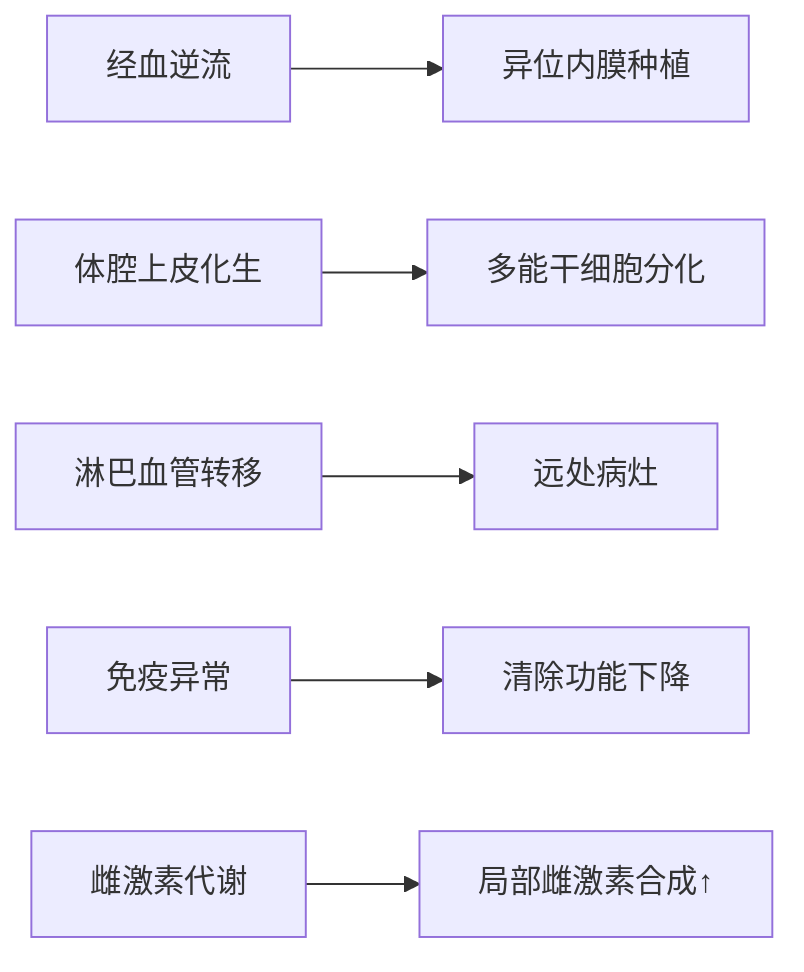

# 子宫内膜异位症医学知识库条目

## 1. 定义
**子宫内膜异位症**（Endometriosis）是指具有生长功能的**子宫内膜组织（腺体和间质）** 出现在子宫腔被覆内膜及子宫肌层以外的部位，是一种雌激素依赖的慢性炎症性疾病。根据病灶分布可分为：
- **腹膜型**（浅表病灶）
- **卵巢型**（子宫内膜异位囊肿/巧克力囊肿）
- **深部浸润型**（DIE，浸润深度≥5mm）
- **其他部位型**（如肺、肠道等）
（ESHRE 2022指南）

## 2. 流行病学

### 发病率和患病率
| 人群 | 患病率 | 数据来源 |
|------|--------|----------|
| **育龄女性总体** | 约10% | Lancet 2023 |
| **不孕症女性** | 25-50% | Hum Reprod 2023 |
| **慢性盆腔痛女性** | 70-90% | ACOG 2023 |
| **中国育龄女性** | 5-10% | 中华妇产科杂志2023 |

### 主要风险因素
- **遗传因素**：一级亲属患病风险增加7倍（WES研究显示NPSR1基因多态性）
- **生殖道畸形**：梗阻性畸形（如阴道闭锁）风险增加80%
- **月经因素**：初潮早（<12岁）、周期短（<27天）、经期长（>7天）
- **环境因素**：二噁英暴露（动物实验证实）

### 人群特征
- **年龄**：25-35岁高发，但可发生于初潮后至绝经前任何年龄
- **种族差异**：亚洲女性发病率高于白人女性（OR=1.4）
- **特殊人群**：不孕症患者中约50%存在内异症

## 3. 病因与病理生理学

### 核心机制：多因素共同作用


**关键病理生理过程**：
1. **免疫清除缺陷**：
   - NK细胞活性↓（KIR基因多态性）
   - 巨噬细胞分泌IL-8/TNF-α→炎症反应
2. **雌激素正向调控**：
   - 异位灶芳香化酶（CYP19A1）高表达→局部E2合成
   - 17β-HSD1↑→雌酮→雌二醇转化增加
3. **神经血管增生**：
   - VEGF↑→新生血管
   - NGF↑→神经纤维长入→疼痛
4. **纤维化形成**：
   - TGF-β1↑→成纤维细胞活化→粘连

## 4. 临床表现

### 常见症状体征（按频率排序）
1. **疼痛三联征**：
   - 进行性痛经（80%）
   - 深部性交痛（60-70%）
   - 慢性盆腔痛（50%）
2. **不孕**（40-50%）：机械性粘连/免疫微环境异常
3. **月经异常**（30%）：经量增多/经期延长
4. **肠道症状**（20-25%）：排便痛/便血（直肠受累）
5. **泌尿系症状**（10%）：尿频/血尿（膀胱受累）

### 不典型表现
- 无症状（20-25%，尤其卵巢巧克力囊肿）
- 周期性咯血/气胸（胸膜子宫内膜异位症）
- 坐骨神经痛（骶神经根受累）
- 脐部/会阴部周期性出血结节

### 危险信号（需紧急评估）
⚠️ **巧克力囊肿破裂**→急性腹痛（腹膜刺激征）  
⚠️ **输尿管受压**→肾积水/肾功能损害  
⚠️ **肠梗阻**（深部浸润型累及肠壁）  
⚠️ **大量血尿/便血**

## 5. 诊断

### 诊断标准（ESHRE 2022）
1. **临床诊断**：典型症状+盆腔检查阳性（子宫后倾固定/骶韧带触痛结节）
2. **影像学诊断**：超声/MRI发现特征性病灶
3. **手术确诊**：腹腔镜下见典型病灶+病理检查（可见子宫内膜腺体/间质）

### 关键评估步骤
**1. 病史采集**：
- 疼痛特点（与月经周期关联性）
- 不孕年限及治疗史
- 肠道/泌尿系周期症状
- 家族史（母亲/姐妹患病史）

**2. 体格检查**：
- **妇科检查**：
  - 双合诊：子宫后倾固定、活动差
  - 三合诊：骶韧带结节（触痛+质硬）
  - 阴道后穹隆：紫蓝色结节
- **其他系统**：肠鸣音（肠梗阻征象）、肾区叩痛

**3. 实验室检查**：
| 项目 | 意义 | 敏感度/特异度 |
|------|------|---------------|
| **CA125** | 监测病情活动度 | 敏感度40-60%<br>特异度80% |
| **HE4** | 鉴别卵巢癌 | ROMA指数 |
| **其他** | 贫血（长期出血） | 无特异性 |

**4. 影像学检查**：
| 检查类型 | 典型表现 | 敏感度 | 特异度 |
|----------|----------|--------|--------|
| **经阴道超声** | 卵巢"毛玻璃样"囊肿<br>（壁厚、内部低回声） | 80% | 90% |
| **MRI T1/T2** | T1高信号（出血）<br>T2"阴影征"（DIE） | 90% | 95% |
| **直肠超声** | 直肠壁低回声结节 | 85% | 90% |
| **腹腔镜** | 蓝/棕/白色病灶<br>粘连/巧克力囊肿 | 金标准 | 100% |

### 鉴别诊断
| 疾病 | 关键区分点 |
|------|------------|
| **盆腔炎性疾病** | 发热/脓性分泌物<br>病原体检测阳性 |
| **卵巢恶性肿瘤** | CA125显著↑<br>超声见实性区/血流丰富 |
| **子宫腺肌病** | 子宫均匀增大<br>MRI见结合带增宽 |
| **肠易激综合征** | 症状与月经无关<br>精神心理因素明显 |

## 6. 治疗

### 治疗原则
- **目标**：减灭病灶、缓解疼痛、促进生育、预防复发
- **个体化方案**：根据年龄、症状、生育需求、病灶类型制定

### 一线治疗方案
**药物治疗**（适用于疼痛症状为主）：
```markdown
1. **非甾体抗炎药（NSAIDs）**：
   - 布洛芬400-600mg tid（餐后）
   - 用于控制轻中度疼痛
   
2. **激素治疗**：
   - 联合口服避孕药（COC）：炔雌醇20μg+屈螺酮3mg（周期性/连续）
   - 孕激素：地诺孕素2mg/d（长期使用，可缩瘤）
   - GnRH-a：亮丙瑞林3.75mg/月 IM×6月（+反向添加治疗）

3. **中药辅助**：桂枝茯苓胶囊（3粒 tid）改善微循环
```

**非药物治疗**：
- **心理干预**：认知行为疗法（CBT）改善疼痛感受
- **物理治疗**：经皮电神经刺激（TENS）

### 二线/手术治疗
| 术式 | 适应证 | 注意事项 |
|------|--------|----------|
| **腹腔镜病灶切除** | 所有类型，尤其DIE | 保护邻近器官（肠/输尿管） |
| **卵巢囊肿剔除** | 卵巢型>4cm | 保护卵巢储备（无能量器械） |
| **子宫切除术** | 无生育要求+多器官受累 | 需同时切除双侧附件（防复发） |

### 特殊人群管理
- **青少年**：
  - 首选COC（控制疼痛+抑制进展）
  - 慎用GnRH-a（骨密度影响）
- **不孕患者**：
  - 手术提高自然妊娠率（ASRM分期I-II期）
  - IVF-ET（III-IV期首选）
- **近绝经期**：
  - 药物过渡至绝经（孕激素/ GnRH-a）
  - 慎用雌激素替代

### 疗效评估
- **疼痛评分**：VAS下降≥3分
- **生育结局**：术后12个月妊娠率
- **复发评估**：超声/MRI（每年随访）
- **血清标志物**：CA125下降>50%（与病情活动相关）

## 7. 预后
| 指标 | 数据 | 影响因素 |
|------|------|----------|
| **复发率** | 10-50%/5年（未长期药物维持） | 分期/手术彻底性 |
| **恶变风险** | <1%（主要为卵巢透明细胞癌） | 长期未治疗囊肿>10cm |
| **生育改善** | I-II期术后妊娠率40-60% | 年龄/合并症 |
| **疼痛缓解** | 药物控制有效率70-80% | 神经浸润程度 |

## 8. 预防
**一级预防**（证据有限）：
- 减少经血逆流（避免经期性交/剧烈运动）
- 延长哺乳期（抑制排卵）
- 避免环境内分泌干扰物（双酚A/邻苯二甲酸酯）

**二级预防**：
- 高危人群（痛经/不孕）早期筛查（超声+CA125）
- 长期药物管理（地诺孕素/COC）
- 术后药物维持（减少复发）

## 9. 最新进展（2023-2024）
1. **靶向药物**：
   - GnRH拮抗剂（艾拉戈克）口服制剂（延长至2026年专利）
   - 芳香酶抑制剂（来曲唑）联合COC（深部浸润型疼痛控制率↑）

2. **诊断技术**：
   - 经血干细胞检测（CD44v6+细胞）
   - 微RNA谱（miR-451a/miR-21）作为无创标志物

3. **基础研究**：
   - 靶向IL-33/ST2通路的单抗（II期临床）
   - 表观遗传调控（DNMT抑制剂）

> **免责声明**：本文内容依据循证医学证据（截至2024年），但临床决策需个体化。具体诊疗请遵循最新指南和执业医师建议。

---

### 主要参考文献
1. ESHRE. *Endometriosis Guideline* (2022)  
2. ACOG. *Management of Endometriosis* (2023)  
3. Zondervan KT. *Endometriosis*. NEJM (2023)  
4. 《妇产科学》（第9版）人民卫生出版社  
5. NIH. *Research Plan on Endometriosis* (2024-2028) 