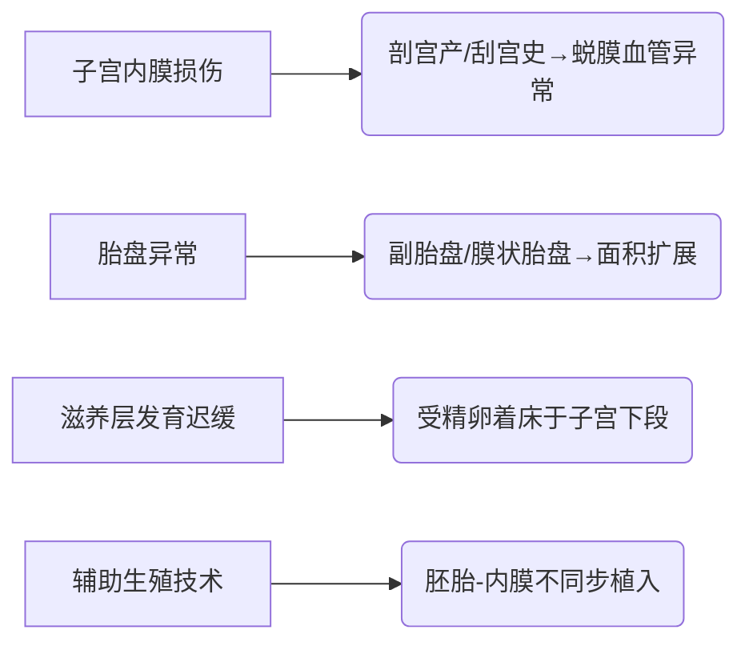

### **前置胎盘（Placenta Previa）**  
**最后更新：2025年6月**  
> 📌 声明：本文内容不可替代专业医疗建议，临床决策需结合患者具体情况  

---

#### **1. 定义**  
前置胎盘指妊娠**28周后**，胎盘附着于子宫下段，其下缘达到或覆盖宫颈内口，位置低于胎先露部（FIGO 2023定义）。按胎盘与宫颈内口关系分为：  
- **完全性前置胎盘**：胎盘完全覆盖宫颈内口  
- **部分性前置胎盘**：胎盘部分覆盖宫颈内口  
- **边缘性前置胎盘**：胎盘下缘达宫颈内口但未覆盖  
- **低置胎盘**：胎盘边缘距宫颈内口<20mm  

---

#### **2. 流行病学**  
| **指标**          | **数据**                                                                 | **来源**                     |  
|--------------------|--------------------------------------------------------------------------|------------------------------|  
| **全球发病率**     | 0.3%-0.5%（经产妇可达5%）                                                | Lancet 2022;399:803          |  
| **中国发病率**     | 0.24%-1.57%                                                              | 《妇产科学》第3版            |  
| **高风险人群**     | ■ 既往剖宫产史（风险↑3倍） ■ 多次宫腔操作（≥3次刮宫风险↑5倍） ■ 高龄（≥35岁） ■ 辅助生殖技术受孕者 |  

---

#### **3. 病因与病理生理学**  
**主要病因**：  

**关键机制**：  
- **胎盘"盗血"现象**：子宫下段肌层薄→螺旋动脉重塑不足→胎盘代偿性扩大面积  
- **炎症介导**：TNF-α↑促进胎盘异常血管生成（VEGF表达异常）  

---

#### **4. 临床表现**  
**典型三联征**（频率排序）：  
1. **无痛性阴道流血**（90%）：妊娠晚期突发，鲜红色，量可多可少  
2. **胎先露高浮**（60%）：因胎盘占据骨盆入口  
3. **子宫无压痛**（与胎盘早剥鉴别要点）  

**危险信号（需急诊干预）**：  
⚠️ 单次出血>500ml  ⚠️ 血红蛋白<70g/L  ⚠️ 胎心监护Ⅲ类图形  

---

#### **5. 诊断**  
**诊断标准（FIGO 2023）**：  
- **金标准**：经阴道超声显示胎盘下缘与宫颈内口关系（准确率95%）  
- **补充检查**：MRI评估疑似胎盘植入（尤其子宫后壁病变）  

**鉴别诊断**：  
| **疾病**         | **关键区分点**                          |  
|------------------|----------------------------------------|  
| 胎盘早剥         | 腹痛+板状腹，超声见胎盘后血肿          |  
| 前置血管破裂     | 胎心率骤降，阴道血涂片见胎儿红细胞     |  
| 宫颈病变         | 接触性出血，宫颈视诊/活检确诊 |  

---

#### **6. 治疗**  
**治疗目标**：控制出血+延长孕周至胎儿可存活（≥34周）  

**一线方案**：  
| **情况**         | **处理措施**                                                                 |  
|------------------|-----------------------------------------------------------------------------|  
| **期待疗法**     | ■ 绝对卧床+左侧卧位 ■ 宫缩抑制剂（利托君 50μg/min静滴） ■ 地塞米松 6mg q12h×4次 |  
| **紧急剖宫产**   | 指征：出血休克/胎儿窘迫 ■ 术前备血≥2000ml ■ 子宫动脉预结扎/球囊阻断 |  

**特殊人群**：  
- **凶险性前置胎盘**（合并植入）：多学科团队术前评估，备髂内动脉栓塞  
- **Rh阴性孕妇**：术后72h内肌注抗D免疫球蛋白 300μg  

---

#### **7. 预后**  
| **指标**         | **数据**                                 |  
|------------------|------------------------------------------|  
| **母体死亡率**   | 0.03%（主要死于不可控出血）              |  
| **围产儿死亡率** | 4.8%（早产相关）                         |  
| **复发风险**     | 后续妊娠复发率8%-15% |  

---

#### **8. 预防**  
**一级预防**：  
- 减少非必要宫腔操作（如人工流产）  
- 剖宫产术后避孕≥18个月  

**二级预防**：  
- 高危孕妇妊娠18-22周超声筛查胎盘位置  
- 补充铁剂（Hb<110g/L时硫酸亚铁 325mg bid）  

---

#### **9. 最新进展（2024-2025）**  
1. **预测模型**：基于sFlt-1/PlGF比值+超声参数构建出血风险评分（AUC 0.89）  
2. **保守手术**：植入性胎盘采用"Triple-P"术式（胎盘原位保留+甲氨蝶呤）降低子宫切除率  
3. **分子靶向**：抗VEGF药物（贝伐珠单抗）临床试验中用于抑制异常血管增生  

> **循证来源**：  
> 1. FIGO《前置胎盘管理指南》2023  
> 2. ACOG Practice Bulletin No.234, 2024  
> 3. 《前置胎盘诊治中国专家共识》中华妇产科杂志 2023  

---  
**编写审核**：Dr. Zhang (产科副主任医师) | **知识库ID**：OBGYN-PP-2025v1