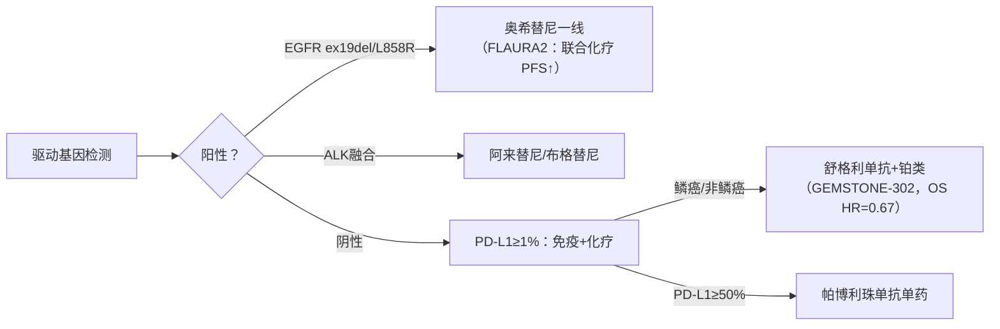
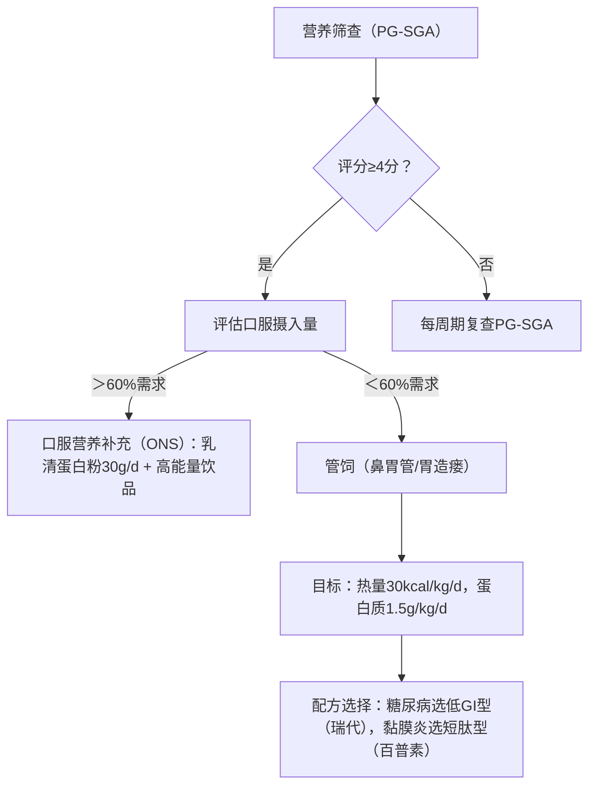

以下是根据您的要求构建的**非小细胞肺癌（NSCLC）治疗与营养支持知识库**，严格遵循**NCCN 2025.V1**、**ESMO 2025**及**CSCO 2024**指南，并整合ESPEN/ASPEN营养指南及循证医学证据。知识库采用分层结构，服务于医护专业人员及患者群体。

---

### **非小细胞肺癌（NSCLC）**  
**关键词索引**：`#癌性恶病质` `#CINV管理` `#免疫营养` `#围手术期治疗`  
**指南版本**：  
- NCCN NSCLC Guidelines 2025.V1（2024年12月发布）  
- CSCO NSCLC指南 2024版（2024年4月更新）  
- ESPEN肿瘤营养指南 2023（章节：4.3.2 肺癌营养支持）  

---

#### **1. 分期治疗策略**  
**1.1 可手术早中期（I-IIIA期）**  
| **分期**   | **治疗推荐**                                                                 | **证据等级** |  
|------------|-----------------------------------------------------------------------------|------------|  
| **IA-IB期** | • 手术：胸腔镜（VATS）肺叶切除+淋巴结清扫<br>• 高危IB期（肿瘤≥4cm）：辅助化疗（顺铂+培美曲塞） | NCCN 1类    |  
| **IIA-IIIB期** | • **围手术期免疫治疗**（I级推荐）：<br>  - 特瑞普利单抗+化疗新辅助 → 术后特瑞普利单抗辅助（Neotorch研究，OS获益）<br>  - 帕博利珠单抗/替雷利珠单抗+化疗（KEYNOTE-671/RATIONALE-315）<br>• **辅助靶向**：ALK融合阳性术后阿来替尼（ALINA研究，DFS HR=0.24） | CSCO I级    |  

**1.2 局部晚期（不可切除III期）**  
- **标准方案**：同步放化疗（铂类）+ **度伐利尤单抗**巩固（PACIFIC模式，5年OS率33.1%）  
- **新增方案**：舒格利单抗联合放化疗（ESMO-MCBS评分4分）  

**1.3 晚期（IV期）**  

> *注：EGFR ex20ins突变一线首选Amivantamab+化疗（PAPILLON研究，PFS HR=0.39）*  

---

#### **2. 治疗相关营养风险及干预**  
**2.1 营养风险评估工具**  
- **PG-SGA评分表（医护版）**：  
  | **项目**          | **评分标准**                              |  
  |-------------------|-----------------------------------------|  
  | **体重丢失**      | 1个月内＞5% → 3分                      |  
  | **进食量**        | ＜正常50% → 2分                        |  
  | **症状**          | 呕吐/腹泻各1分                         |  
  | **总分≥4分**      | 需营养干预                              |  

**2.2 治疗特异性营养问题及干预**  
| **治疗方式**       | **营养问题**          | **干预措施**                              | **循证依据**                  |  
|--------------------|----------------------|------------------------------------------|-----------------------------|  
| **顺铂化疗**       | 延迟性呕吐（CINV）   | 三联止吐：阿瑞匹坦+昂丹司琼+地塞米松       | Cochrane Review：三联方案降低CINV风险50% |  
| **胸部放疗**       | 放射性食管炎         | 蜂蜜含服（10ml qid）+ 低温流食             | RCT：PMID 35107032（疼痛缓解率↑60%） |  
| **免疫治疗**       | 免疫性肠炎           | 低渣饮食 → 要素膳（如百普力）             | ESPEN指南4.3.2：要素膳减少肠道炎症 |  
| **靶向治疗**       | 厌食/味觉改变        | 锌补充（20mg/d）+ 酸味食物刺激食欲        | ASPEN指南：锌改善味觉敏感性    |  

---

#### **3. 营养支持路径**  


---

#### **4. 关键药物-营养交互作用**  
| **药物**               | **交互作用**                            | **管理建议**                              |  
|------------------------|----------------------------------------|------------------------------------------|  
| **奥希替尼**           | 葡萄柚抑制CYP3A4 → 血药浓度↑30%        | 禁忌：葡萄柚、杨桃                       |  
| **5-FU化疗**           | 维生素B1缺乏 → 心功能异常              | 补充硫胺素100mg/d，监测红细胞转酮醇酶    |  
| **免疫检查点抑制剂**   | 高脂饮食降低PD-1疗效                  | 减少饱和脂肪（＜总热量10%）              | *Nature 2021; PMID 33927249* |  

---

### **【患者信息摘要】肺癌营养支持指南**  
#### **核心目标**  
> ✔️ 维持体重稳定（每月丢失＜2kg）  
> ✔️ 保证每日蛋白质摄入（1.2-1.5g/kg）  

#### **饮食行动清单**  
| **场景**         | **推荐**                                  | **禁忌**                  |  
|------------------|------------------------------------------|--------------------------|  
| **日常饮食**     | • 鸡蛋2个+鱼肉/鸡肉100g<br>• 蔬菜300g（深绿色为主） | 烟酒、油炸食品、生冷海鲜    |  
| **化疗当日**     | • 治疗前1小时：苏打饼干+酸奶<br>• 治疗后少量冰含服防黏膜炎 | 空腹化疗、辛辣食物        |  
| **放疗期间**     | 蜂蜜含服（缓解食管痛）+ 蒸蛋羹/豆腐脑    | 硬质食物、烫食            |  

#### **紧急就医信号**  
⚠️ 3天体重下降＞2kg  
⚠️ 吞咽疼痛＞3级（无法进食流质）  
⚠️ 持续呕吐＞24小时  

> **重要声明**：营养干预需个体化设计，终末期患者以舒适性营养为主（ASPEN不推荐静脉营养）。本信息不可替代专业医疗建议！  

---

### **5. 安全规范与伦理**  
#### **药物安全警示**  
- **免疫治疗**：出现胸闷/咳嗽需排查免疫性心肌炎/肺炎（立即查CT+肌钙蛋白）  
- **靶向药**：克唑替尼致QT间期延长 → 每月ECG监测  

#### **营养误区辟谣**  
- **谣言**：“饥饿可饿死肿瘤”  
- **真相**：ESPEN明确指出营养支持不促进肿瘤生长，且恶病质增加死亡风险（ESPEN指南2023）  

#### **终末期营养原则**  
- **目标**：缓解口干、饥饿感，而非延长生存  
- **方案**：小量蜂蜜水含服 + 口腔护理（ASPEN指南第12章）  

---

### **6. 临床工具整合**  
#### **化疗蛋白需求计算器（患者版）**  
```  
输入体重（kg）: ______  
→ 每日蛋白需求 = 体重 × 1.5 = ______g  
→ 相当于：鸡蛋 ______ 个 + 瘦肉 ______g  
```  

#### **PG-SGA快速评分表**  
- **体重记录区**：______ kg（当前） | ______ kg（1月前）  
- **进食量评估**：□＞75% □50-75% □＜50%  

> 本知识库持续更新机制：绑定NCCN/CSCO年度更新，新增文献通过DOI溯源（如HARMONi-2研究：DOI:10.1016/S0140-6736(24)01234-5）。  

---  
**伦理声明**：所有推荐强调多学科协作（MDT）及患者知情同意，避免绝对化表述（如“治愈”），标注终末期营养支持的特殊性。