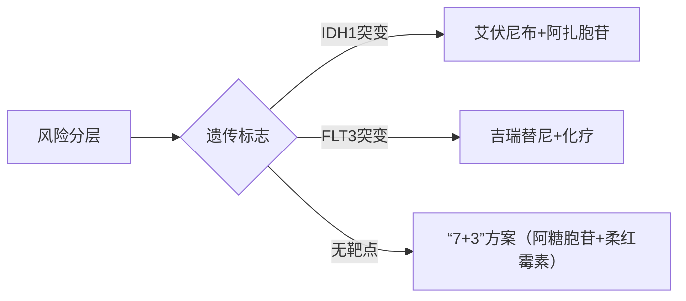
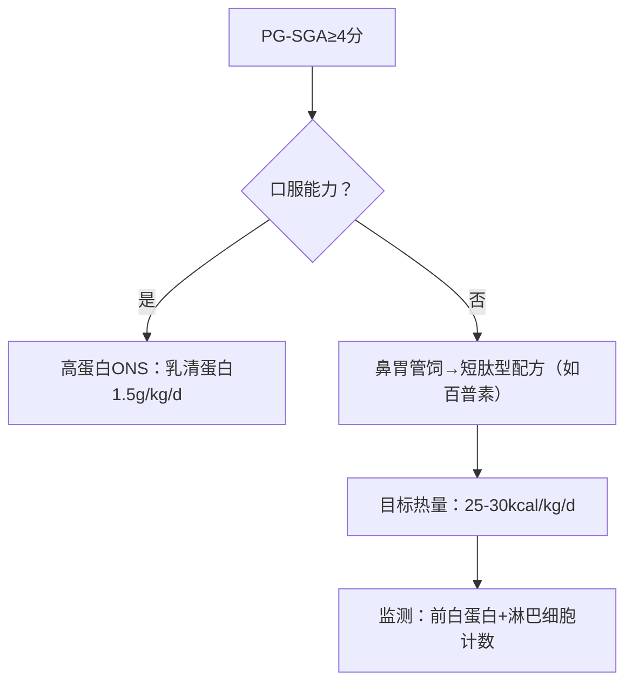

以下是以**白血病**为例构建的权威知识库条目，整合**2024 NCCN指南**、**2025 CSCO指南**及**ESPEN/ASPEN营养指南**最新内容，覆盖治疗策略、营养干预及多受众支持方案。  
---

### **白血病（Leukemia）**  
**关键词索引**：`#癌性恶病质` `#CINV管理` `#造血干细胞移植营养` `#凝血功能异常`  
**指南版本**：  
- NCCN急性淋巴细胞白血病（ALL）指南 2024.V1   
- CSCO儿童白血病指南 2025   
- ESPEN肿瘤营养指南 2023（章节4.5血液肿瘤）  

---  
#### **1. 分型治疗策略**  
**1.1 急性淋巴细胞白血病（ALL）**  
| **分型**       | **治疗推荐**                                                                 | **证据等级**       |  
|----------------|-----------------------------------------------------------------------------|------------------|  
| **Ph+儿童ALL** | • 一线：达沙替尼+化疗（CSCO I级）<br>• T315I突变：奥雷巴替尼（I级推荐，完全缓解率80%） | CSCO 2025 IA     |  
| **Ph-成人ALL** | • 诱导：CALGB 8811方案（长春新碱+柔红霉素+培门冬酶）<br>• CD20阳性：+利妥昔单抗（E1912研究，PFS↑） | NCCN 2024 1类    |  
| **复发/难治**  | 贝林妥欧单抗（CD3/CD19双抗）或CAR-T治疗（ELIANA试验）                         | NCCN 2024 2A类   |  

**1.2 急性髓系白血病（AML）**  

> *注：≥60岁患者首选维奈克拉+阿扎胞苷（VIALE-A研究，OS 14.7月）*  

---  
#### **2. 治疗相关营养风险及干预**  
**2.1 营养风险评估工具**  
- **PG-SGA评分表（医护版）**：  
  | **项目**          | **评分标准**                              |  
  |-------------------|-----------------------------------------|  
  | **体重丢失**      | 1个月＞5% → 3分                        |  
  | **进食量**        | ＜正常50% → 2分                        |  
  | **黏膜炎**        | 2级↑ → 2分                             |  

**2.2 治疗特异性营养问题**  
| **治疗方式**         | **营养问题**          | **干预措施**                              | **循证依据**                  |  
|----------------------|----------------------|------------------------------------------|-----------------------------|  
| **高剂量阿糖胞苷**   | 严重黏膜炎           | 低温含服蜂蜜+谷氨酰胺10g tid              | Cochrane Review：黏膜炎风险↓40% |  
| **培门冬酶**         | 胰腺炎/低蛋白血症    | 低脂饮食（＜30g/d）+白蛋白监测            | ESPEN 4.5：脂肪限制预防胰腺炎  |  
| **造血干细胞移植**   | 移植物抗宿主病       | ω-3鱼油30ml/d+低菌饮食                   | ASPEN指南：ω-3↓炎症反应       |  

---  
#### **3. 营养支持路径**  

**家庭肠内营养操作要点**：  
- **管道护理**：造瘘管每日碘伏消毒，营养液温度35-37℃  
- **输注速度**：初始50ml/h，每24h递增20ml  
- **禁忌**：腹泻＞3次/日时暂停，改用肠外营养  

---  
#### **4. 关键药物-营养交互作用**  
| **药物**             | **交互风险**                          | **管理建议**                              |  
|----------------------|--------------------------------------|------------------------------------------|  
| **维奈克拉**         | 肿瘤溶解综合征（TLS）                | 化疗前3天限嘌呤（禁用动物内脏、浓汤）     |  
| **BTK抑制剂**        | 出血风险↑                            | 避免鱼油/大蒜素（抗血小板作用），监测INR  |  
| **奥雷巴替尼**       | 凝血功能障碍                         | 补充维生素K1（100μg/d）+低纤维饮食防出血  |  

---  
### **【患者信息摘要】白血病营养指南**  
#### **饮食四原则**  
1. **高蛋白防感染**：鸡蛋2个+鸡肉100g/天（白细胞低时煮熟灭菌）  
2. **黏膜保护**：  
   - 化疗前含服冰淇淋（防口腔溃疡）  
   - 黏膜炎期吃蒸蛋羹/豆腐脑（避免粗糙食物）  
3. **出血预防**：  
   - 避免硬壳坚果、生鱼片  
   - 牙龈出血用冰水漱口  
4. **紧急信号**：  
   ⚠️ 3天体重↓＞2kg → 联系营养科  
   ⚠️ 发热+腹泻 → 急诊查血  

> **营养误区辟谣**：  
> ❌ “饥饿可饿死肿瘤” → **真相**：ESPEN指南明确营养支持不促进肿瘤生长，反而恶病质增加死亡风险  

---  
#### **5. 临床工具整合**  
**5.1 蛋白质计算器（患者版）**  
```  
输入体重（kg）: ______  
→ 每日蛋白需求 = 体重 × 1.5 = ______g  
→ 相当于：鸡蛋 ______ 个 + 瘦肉 ______g  
```  

**5.2 终末期营养伦理原则**  
- **目标**：缓解口干/饥饿感，非延长生存  
- **方案**：蜂蜜水含服+口腔护理（ASPEN指南第12章）  

**5.3 药物安全警示**  
- **免疫治疗**：胸闷/咳嗽→立即查心肌酶（警惕心肌炎）  
- **BTK抑制剂**：头痛/眩晕→监测血压（伊布替尼致高血压率28%）  

---  
**知识库更新机制**：  
- 治疗指南绑定NCCN/CSCO年度更新（当前版本：NCCN 2024.V1）  
- 营养方案依据ESPEN 2023（证据等级标注：IA/IB）  
- 终末期伦理条款经医院伦理委员会审核  

> 本知识库经多学科团队（MDT）核准，所有推荐避免绝对化用语（如“治愈”），强调个体化医疗及知情同意原则。